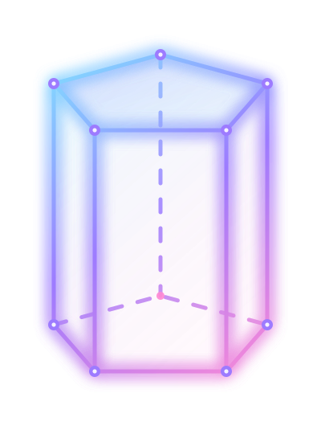
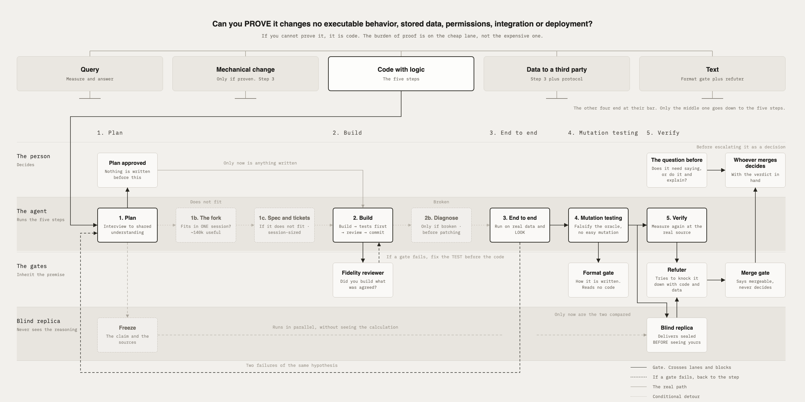

<p align="center"></p>

<h1 align="center">Prisma Harness</h1>

<p align="center"><em>A prism splits one light into separate paths. PRISMA takes a claim and forces it through independent routes until it survives or falls.</em></p>

<p align="center">
  
  
  <a href="https://github.com/juanquijandria/prisma-harness/actions/workflows/selftests.yml"></a>
  <a href="LICENSE"></a>
</p>

<p align="center"><sub>English · <a href="README.es.md">Español</a></sub></p>

<p align="center">
  <a href="#install"><b>Install</b></a> ·
  <a href="METHOD.md"><b>The method</b></a> ·
  <a href="STYLE.md"><b>The writing rules</b></a> ·
  <a href="#how-a-person-uses-it"><b>How it is used</b></a> ·
  <a href="#configure"><b>Configure</b></a>
</p>

## Why it exists

An agent writes the code and also writes the claim that the code works. It picks the tests, reads their output and decides they passed. That loop has no way out from the inside, because a test cannot refute the premise it shares with what it verifies. The failures that reach production are the ones every check agreed about, and green usually means the checks never covered the thing that broke.

PRISMA adds the checks an agent cannot give itself. Gates that block mechanically before a push, a step that forces someone to look at the real surface, a refuter whose job is to knock the finding down, and a blind replica that gets the claim and the sources but never the reasoning. Every rule in it was paid for by a real failure, and a new one only enters if it turns red on the case that pays for it.

This is what it looks like inside a session. The agent tried to write a documentation page without opening the index, and then tried to push a change of 1,202 lines.

```
INDEX GATE: you are about to write a page under wiki/ without having opened
index.md in this session. Read <docs root>/index.md first so you do not create
a duplicate page or leave the index stale, then retry.

SIZE GATE: 1202 lines changed, the push is blocked.
This repository blocks a push over 400 changed lines and warns
over 200. Reviewers stop finding things long before they finish reading.
```

PRISMA is a verification method for work that an agent produces, and this repository is the method packaged as a Claude Code plugin. Five lanes decide how much verification a request needs, five steps run for code with logic, and five gates with distinct names decide whether the work leaves the machine. The hooks block what the method says must not pass; the skills run the steps; the written method says why.

It runs on a single model. There is no second engine, no external service, no account. The one place where the method was born with two engines, the blind replica, is declared as single-model and stays honest about what that costs.

## The method in one drawing



Three rules hold over every lane and are not another step.

1. Every claim is a hypothesis until measured by an independent route.
2. The instrument is calibrated on the real corpus, and whoever calibrates says what was not tested.
3. A line enters the method only if it turns red on its historical case.

The order the agent follows is written, not drawn. It lives in `METHOD.md` and in `skills/prisma/SKILL.md`, which is what runs when you say PRISMA, with the four step skills next to it.

## How a person uses it

1. **Install once**, the two commands below. There is no second plugin to install.
2. **Open a new session and work as always.** You do not call anything. The gates run on their own and speak only when something is wrong. A write to your docs without opening the index is blocked and the agent is told what to read. A push with stray comments, over four hundred changed lines or a red linter is blocked and the agent is told what to do. A page with an em-dash or voseo keeps the agent from closing its turn until it is fixed. The writing rules arrive at session start, so the agent writes that way without being asked.
3. **Say "PRISMA"** when you want the whole method on a piece of work. That is the only thing you ever call. The skill routes the request through the five lanes and runs what they require, up to the five steps and five gates.
4. **Read `METHOD.md`** when you want to know why a gate did what it did.
5. **Update** with the commands in the next section, or turn on auto-update for this marketplace once in `/plugin` and forget about it.

## Install

First the two tools the gates need, in your terminal. Skip this if you already have them.

```
brew install jq python
```

```
sudo apt install jq python3
```

Then, inside Claude Code, two commands.

```
/plugin marketplace add juanquijandria/prisma-harness
/plugin install prisma-harness@prisma-harness
```

To update, run this in your terminal and open a new session.

```
claude plugin marketplace update
claude plugin update prisma-harness@prisma-harness
```

To never think about it again, open `/plugin` inside Claude Code, go to Marketplaces, pick `prisma-harness` and turn on auto-update.

Requirements: `jq`, `python3` or `python`, `git`, `awk`, `cmp`, `bash`, `mktemp`, `find`, `sed`. If any is missing, PRISMA tells you at session start with the install command and asks before installing anything.

Every selftest and every push gate control runs on GitHub Actions on Ubuntu, macOS and Windows with Git Bash, on each push. The badge at the top is that run. On Windows, Claude Code needs Git for Windows so the hooks run under Git Bash, and the first Windows run caught two things now fixed, Python writing CRLF into the parser output and `python` being the only name available. Install the tools with `winget install jqlang.jq Python.Python.3.12`. WSL 2 behaves like Linux.

## What is inside

| Piece | What it does | When it runs |
|---|---|---|
| `METHOD.md` | the method in English, lanes, steps, gates, single-model mode | you read it |
| `docs/es/METHOD.md` | the canonical block in Spanish, the reference this plugin ships | `check-canonical-sync.sh` compares your copies against it at session start |
| `STYLE.md`, `docs/es/STYLE.md` | the writing rules and which ones the format gate enforces | you read it |
| `skills/prisma/SKILL.md` | the operating order of the method, invoked as `prisma` | when you say "PRISMA" |
| `skills/prisma-plan/SKILL.md` | step 1, the interview in rounds that leaves a record and closes with the lane and the session estimate | when `prisma` reaches step 1 |
| `skills/prisma-build/SKILL.md` | step 2, tests first at the agreed seams, every control seen red before the code, then the review, then the commit | when `prisma` reaches step 2 |
| `skills/prisma-fidelity-review/SKILL.md` | the fidelity reviewer, two axes kept apart, run in a fresh subagent against the plan record | when `prisma-build` reaches its review, or when you ask for a review |
| `skills/prisma-diagnose/SKILL.md` | step 2b, the loop before the hypothesis, and the step the defect escaped from at the end | when something is broken |
| `hooks/gate-read-index.sh` | blocks a write under the docs dir if the session never read the index | `PreToolUse` on Write and Edit |
| `hooks/pre-push-comments.sh` | blocks a push or PR whose diff adds comment lines, figures in comments, or `file:line` references | `PreToolUse` on Bash |
| `hooks/pre-push-size.sh` | warns over 200 changed lines, blocks over 400, and tells a stale branch apart from a big change | `PreToolUse` on Bash |
| `hooks/pre-push-lint.sh` | runs the repo's own linter, `php-cs-fixer` or `eslint`, on the diff before the push | `PreToolUse` on Bash |
| `hooks/shell-traps.sh` | blocks two commands that fail without saying so, a `grep --include` pattern left unquoted under zsh, which zsh aborts with no match while the rest of the line goes on, and `timeout` where it is not installed, so the command it wraps never runs. `PRISMA_SHELL_TRAPS_OK=1` lets one through | `PreToolUse` on Bash |
| `hooks/format-gate.sh` | the format gate over pages touched today, rules in `.prisma-format.conf` | `Stop` |
| `hooks/check-canonical-sync.sh` | compares the canonical block across every registered copy, never edits | `SessionStart` |
| `hooks/session-voice.sh` | injects the writing rules of `STYLE.md` into every session, so the agent writes that way without being asked. It says so once per project and `PRISMA_VOICE=0` switches it off | `SessionStart` |
| `hooks/session-deps.sh` | at session start, tells the agent which required tools are missing, with the install command, and to ask before installing. Silent when nothing is missing. `PRISMA_DEPS_CHECK=0` switches it off | `SessionStart` |
| `hooks/notes-machinery.sh` | reports a git repository, a package manifest, a module folder or a virtual environment nested inside a tree meant to hold information and no code. It needs `PRISMA_NOTES_ROOT`, and without it the check does not apply | `SessionStart` and `Stop` |
| `hooks/blind-replica.sh` | builds the blind brief, claim and sources only, for the fifth gate, and with an auditor configured its exit code is the verdict | you call it |
| `hooks/receipt.sh` | one local line per block, escape, warning, or gate that could not measure, and a summary you paste to whoever asks | the gates write it, you read it |
| `hooks/measure-comments.sh`, `measure-diff-size.sh`, `compare-base.sh`, `command-invokes.sh`, `strip-quotes.sh`, `escape-declared.sh` | the helpers the gates share | called by the gates |

Eleven pieces have a `--selftest`, the index gate, the format gate, the sync check, the blind replica, the session voice, the dependency check, the receipt, the machinery detector, the command parser, the escape parser and the shell traps gate. The three push gates are covered by 78 controls against a fixture repo in `tests/push-gates-controls.sh`, which block a real defect and then let the corrected diff through. `tests/push-gates-never-fabricate.sh`, `tests/page-gates-never-fabricate.sh` and `tests/page-gates-receipts.sh` add 62 more on what a gate reports when it did not measure, that it never reports a verdict and that it leaves its line in the receipt, and every one of them was red before the change that made it green, except two counterexamples of the receipt suite that must stay silent and already did. `tests/skills-controls.sh` adds 20 over the text of the four step skills, nine of them on mutated copies that must go red. `tests/runner-controls.sh` adds 20 over the suite itself, run from outside it because a runner cannot run itself. `tests/run-selftests.sh` runs all of it, checks that the pages this repository publishes obey the rules this repository ships, and compares the number of cases each selftest claims against the number it actually printed, because a suite that goes green does not prove every case ran, and a suite that prints no count at all fails. The format gate's own suite in `hooks/format-gate.sh`, the largest at 43 cases, was outside that comparison until 0.6.0 because its closing line did not carry a count. A gate whose tests never fail is decoration.

## The writing rules, and how to turn them off

This plugin sets writing rules at the start of every session, and it tells you so in the first session of each project. If you want the verification and not the prose style, put this in your Claude Code settings.

```json
{ "env": { "PRISMA_VOICE": "0" } }
```

Or say it in your own words to your agent, which is shorter.

```
Turn off the PRISMA writing rules for this project.
```

## Two things that read as heavier than they are

**Something broken does not go through the interview.** `skills/prisma-diagnose/SKILL.md` has its own trigger and asks for no plan record. Step 1 is for work that is being decided, not for a defect that is being reproduced.

**The comments gate does not block until you ask it to.** Out of the box it measures the diff and says what it found. `PRISMA_COMMENTS_BLOCK=1` turns that measurement into a block.

## What is enforced, and by what

"It passed PRISMA" means three different things depending on the promise, and this table says which. A hook blocks on its own. The agent is asked, and the transcript and the receipt are the evidence. A person, or evidence from outside the machine, decides the rest. Nothing in the third kind is enforced by this repository, and saying so is the point. The push gates measure the checked-out HEAD against its base, so a branch pushed from elsewhere is not measured and the gate says so, and a repository listed in `PRISMA_SKIP_REPOS` is never measured at all.

| Promise | Held by | How you know |
|---|---|---|
| no page under the docs dir is written **with Write or Edit** without reading the index | hook | the index gate blocks, and it has no escape. A page written by a shell command is outside it |
| no push from a watched repository carries comment lines, figures in comments or file and line references | hook | the comments gate blocks HEAD, and an escape is recorded in the receipt |
| no push from a watched repository passes the size ceiling | hook | the size gate blocks HEAD, and an escape is recorded |
| a push from a watched repository passes its own linter | hook | the lint gate blocks HEAD, and an escape is recorded |
| a page touched today follows the writing rules | hook | the format gate blocks the stop, and a rule switches off in config |
| the canonical block matches every registered copy | agent | the sync check reports drift at session start and never blocks |
| the five steps run for code with logic | agent | the skill orders them, and the transcript shows whether they ran |
| a finding is reproduced before it is repeated as a fact | agent | the transcript |
| a figure is measured by a second route | agent | `blind-replica.sh` builds the brief and reads the verdict, and it does not judge its truth |
| the result was looked at on the surface a person sees | person | step 3, and nobody else can do it |
| the exit condition holds where the work landed | outside evidence | step 5, on the real source |
| the gates reduce escaped defects | outside evidence | the receipt counts blocks, not whether each block was right |

## Configure

Environment variables, all optional.

| Variable | Default | Meaning |
|---|---|---|
| `PRISMA_DOCS_ROOT` | the project directory | where your documentation lives |
| `PRISMA_DOCS_DIR` | `wiki` | the pages folder under the root that the index gate and the format gate watch |
| `PRISMA_INDEX_FILE` | `index.md` | the file a session must read before writing a page |
| `PRISMA_FORMAT_CONFIG` | `<docs root>/.prisma-format.conf` | rule switches, see `STYLE.md` and `.prisma-format.conf.example` |
| `PRISMA_CANONICAL`, `PRISMA_CANONICAL_COPIES` | the plugin's Spanish block, and `~/.claude/CLAUDE.md` plus the project `CLAUDE.md` when they carry the markers | what the sync check compares |
| `PRISMA_SIZE_WARN_OVER`, `PRISMA_SIZE_BLOCK_OVER` | 200, 400 | the size gate thresholds |
| `PRISMA_COMMENTS_MAX_PCT`, `PRISMA_COMMENTS_MAX_BLOCK` | 0, 0 | the comments gate ceilings |
| `PRISMA_COMMENTS_BLOCK` | 0 | the comments gate measures and warns. Set it to 1 and the ceiling blocks the push |
| `PRISMA_SKIP_REPOS` | empty | absolute paths where the push gates do not apply |
| `PRISMA_AUDITOR_CMD` | empty | a command that receives the blind brief on stdin and answers as a second engine |
| `PRISMA_VOICE` | 1 | set to 0 to stop injecting the writing rules at session start |
| `PRISMA_DEPS_CHECK` | 1 | set to 0 to stop the dependency notice at session start |
| `PRISMA_NOTES_ROOT` | empty | the tree that holds information and no code. Without it the machinery detector says nothing |
| `PRISMA_MACHINERY_MARKERS`, `PRISMA_MACHINERY_SKIP` | `.git node_modules package.json .venv venv`, `.obsidian raw Clippings archive` | what that detector counts as machinery, and the folders it does not walk into |
| `PRISMA_RECEIPT` | 1 | set to 0 to stop writing the receipt |
| `PRISMA_RECEIPT_FILE` | `~/.prisma-harness/receipts.log` | where the receipt is written |
| `PRISMA_REQUIRED_TOOLS` | the requirements above | what the dependency check looks for, spaces or commas |
| `PRISMA_REQUIRED_WRAPPERS` | `timeout` | the programs that wrap another command, which the shell traps gate blocks when one is invoked and not installed |
| `PRISMA_HOOKS_DIR` | the folder of the running hook | where a gate looks for its siblings |
| `PRISMA_UNAME` | the real one | the seam the dependency check uses to test itself |
| `PRISMA_PYTHON`, `PRISMA_JQ`, `PRISMA_TMPDIR`, `PRISMA_PARSER_FAULT` | the real ones, and no fault | seams the gates use to test what they do when a tool, a directory or the parser fails |

The three push gates have a declared escape, `PRISMA_COMMENTS_OK=1`, `PRISMA_SIZE_OK=1`, `PRISMA_LINT_OK=1`, placed in front of the command, and the shell traps gate has `PRISMA_SHELL_TRAPS_OK=1` the same way. The reason goes in the change description. An escape used by default is not a gate. The index gate has no escape, reading the index is the fix. The format gate has no escape either; a rule you do not want is switched off in its config.

**Where 200 and 400 come from.** They are this repository's policy, and they take their shape from one source, [a ten-month case study of 2,500 reviews](https://static1.smartbear.co/support/media/resources/cc/book/code-review-cisco-case-study.pdf) in one product group at Cisco, run and written in 2006 by the vendor of the review tool it measured. Its conclusion is that lines under review should be under 200 and should not exceed 400.

Read it before trusting the defaults, because the number alone hides what the study says about itself. Its defect counts come from a hand-coded sample of 300 of those reviews and not from all 2,500. It sets aside a fifth of the reviews as uninteresting. Its own footnote flags the assumption the whole inference rests on, that true defect density is constant across large and small changes. Its summary advice is narrower than the bullet these defaults follow, between 100 and 300 lines at a time. And it never says whether its lines under review are the lines a diff counts, which is what this gate measures.

That is the only claim this repository makes about the literature. It does not claim to have read all of it, and two earlier versions of this paragraph were refuted by a blind replica that was given the sources and none of the reasoning. The first quoted a ceiling of 1000 that traced to no source. The second said the Cisco data is C and C++, which the study never says. The numbers here are yours to change, and the gate prints the policy and never the study.

## The receipt

Every time a gate blocks something, gets passed with an escape, measures something it was not asked to block, or cannot measure at all, one line lands in `~/.prisma-harness/receipts.log` with the date and time, the gate, the repository, and which of those four it was. The summary counts them in separate columns, because a gate that could not measure did not pass anything. Nothing else, and it never leaves your machine unless you paste it. The hooks running inside Claude Code and the command you run in a terminal read and write that same file, on purpose.

```
sh hooks/receipt.sh --summary
```

That prints one row per gate with blocks, escapes and the first and last day, ready to paste into a chat. It is how you learn which gates catch things in your work and which never fire, and it is what you send to whoever runs PRISMA for a team. It counts blocks, not whether each block was right, and it cannot see what no gate caught. `PRISMA_RECEIPT=0` switches it off, `--path` shows where the file is, `--reset` empties it after asking.

## What not to change without writing the reason

- **The canonical block in `docs/es/METHOD.md`.** Every registered copy is compared against it; editing it here makes every copy drift on purpose.
- **A gate's exit codes.** As a hook, `0` passes and `2` blocks; a gate that cannot measure prints a `WARN` and exits `0`. On the command line the format gate exits `1` on failures. A gate that fails silently fabricates a verdict. `hooks/blind-replica.sh` is a command and not a hook, and its codes are its own, `0` the auditor confirmed, `5` it refuted, `4` no verdict, `6` no auditor is configured and only the brief was printed, `2` the brief itself could not be read.
- **The selftests.** Change a gate, reintroduce the exact defect it exists for, watch it block, remove it, watch it pass. Silence proves nothing.

## Gotchas

- **A hook registered in this session does not run in this session.** Settings are read at startup. Test a new hook in a new session.
- **`hooks/hooks.json` and `skills/` load by convention.** Naming them again in `plugin.json` makes Claude Code refuse the plugin as a duplicate. Measured on 2026-09-14 installing from GitHub, where the local `--plugin-dir` load had not complained.
- **The comments gate skips files whose extension it does not know**, and it counts only lines your diff adds.
- **The index gate watches Write and Edit, not the shell.** A page created with `cat > page.md` or a redirect never reaches it. The gate exists to stop an agent from writing a duplicate page, and an agent that writes through the shell walks past it.
- **The command parser reads a heredoc body as commands.** A `git push` inside a heredoc is reported as a push, so a gate may block a command that never pushes. It is the same over-blocking as an unbalanced quote, and the fix is the same, split the command in two.
- **The shell traps gate knows two traps, and it reads the shell from `$SHELL`.** The `--include` trap only blocks under zsh, and a zsh with `nomatch` switched off never has it, so there the gate blocks a command that would have run, and the escape lets it through. A search run through `xargs`, `eval`, `bash -c` or a script file is outside it, and so is a `timeout` written inside a quoted string.
- **On Windows, a path handed to a native program is rewritten before the program sees it.** Git Bash converts an argument that looks like a Unix path into a Windows one, so `jq --arg some_path /tmp/x` reaches jq as `C:/.../tmp/x` while the JSON it reads still says `/tmp/x`, and the comparison silently fails. The three systems in CI caught this the day it was introduced. A hook here compares paths in the shell and never hands one to jq as data.
- **`--changed` in the format gate finds pages modified today** by file time, not by git.
- **The command parser, `command-invokes.sh`, is not a shell parser.** It respects quotes, escapes, comments and redirections, and it never drops content. It does not resolve expansions, aliases, `eval` or globbing. When a command leaves a quote unbalanced the reading is ambiguous, and it returns the UNION of the plausible readings instead of one, so a gate may block a command it did not need to block; the fix is to split the command in two. It is rare, and deterministic when it happens.
- **The size gate measures HEAD**, not the ref you are pushing. If you push another branch from `main`, it prints a `WARN` and does not measure. It reads HEAD when the hook runs, before the command, so a command that switches branch or rewrites the last commit before its push is measured on the HEAD it started from.
- **The lint and comments gates check what the push sends.** When the command only pushes, they read the commits. The lint gate runs the linter on files from disk, so a file the push sends with uncommitted changes gets a `WARN` instead of a verdict. When the same command commits first, that commit does not exist yet when the gate runs, so both read the working tree, and a commit of only part of what is edited is read whole. A commit the command parser cannot see, behind an alias or `bash -c`, is read as a push alone. A push that sends only tags or deletes a branch is measured by none of the three.

## Where it sits

Remove the model from the diagram of an agent system and what remains is the harness, the tools, permissions, state and evaluators around it. Prisma Harness lives in that layer. It is not a loop, it does not retry work until something passes, and it is not a graph, it does not decide which step runs next. It gives the loop its evidence and the graph its gates, and it only speaks when a gate fails. Steps 1 and 2 ship their own skills, the interview, the test-first build, the fidelity review and the diagnosis loop; they descend from [the engineering skills of Matt Pocock](https://github.com/mattpocock/skills), whose flow ends at the commit, and steps 3, 4 and 5 are the part this harness exists for.

## What Prisma Harness refuses to be

- **Not an eval framework.** No datasets, no scores, no dashboards. Five gates with names, each with the case that pays for it.
- **Not a second model watching the first.** It runs on one model and says out loud what that costs.
- **Not a reviewer of taste.** The format gate reads how a page is written; nothing here grades code quality.
- **Not silent.** A gate that cannot measure prints a warning. Silence never means clean.

## Where the rest is

The method has a history of dated failures behind every rule. This repository ships the rules; the history stays with its author. Contributions are welcome under the same rule the method applies to itself. A new control enters only if it turns red on a real case.

License MIT.
